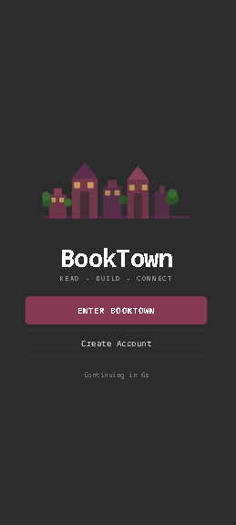
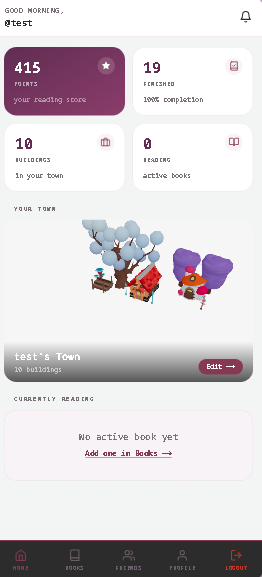
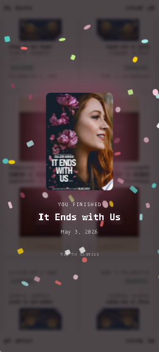

# BookTown — Read · Build · Connect

BookTown turns your reading habit into a living, growing town. Every book you finish unlocks a new building, letting you construct a personalised 3D world that reflects your reading journey. Share your town with friends, follow their progress, and get notified when someone you follow finishes a book.

---

## The Problem It Solves

Most reading trackers are just glorified spreadsheets. They record what you read but give you nothing back. BookTown solves the motivation gap:

- **No reason to keep going** — BookTown rewards finishing books with unlockable 3D buildings, turning a private habit into a visible, evolving creation.
- **Reading feels lonely** — a social layer lets you follow friends, see their activity feed, and visit their towns.
- **Progress is invisible** — a real-time dashboard shows points, completion rate, buildings placed, and active reads at a glance.

---

## Screenshots

### Mobile

| Splash Screen | Dashboard | Book Celebration |
|---------------|-----------|-----------------|
|  |  |  |

---

## Features

- **Reading Library** — add books via Google Books search, track status (to-read / reading / finished), log current page, and rate finished books
- **3D Town Builder** — place, move, and rotate unlocked buildings on an interactive Three.js canvas
- **Gamification** — earn points and unlock new structures every time you finish a book
- **Book Celebration** — confetti animation when you mark a book as finished
- **Social** — follow/unfollow users, browse a friends activity feed, visit anyone's town
- **Real-time Notifications** — WebSocket-powered alerts for new followers and social events
- **Responsive UI** — full mobile experience with a bottom navigation bar

---

## Tech Stack

| Layer | Technology |
|-------|-----------|
| Frontend | Next.js 14, React 18, TypeScript |
| Styling | Tailwind CSS |
| 3D Rendering | Three.js, @react-three/fiber, @react-three/drei |
| Backend | Go 1.25, Fiber v2 |
| Database | SQLite3 (via golang-migrate) |
| Auth | JWT (golang-jwt/jwt/v5), bcrypt |
| Real-time | WebSockets (gofiber/websocket) |
| External API | Google Books API |
| Container | Docker, Docker Compose |

---

## Project Structure

```
Book-Town/
├── backend/               # Go REST API + WebSocket server
│   ├── main.go
│   ├── internal/api/      # Handlers, stores, middleware, WebSocket hub
│   ├── migrations/        # 10 sequential SQL migrations
│   └── Dockerfile
├── frontend/              # Next.js application
│   ├── app/               # App Router pages (dashboard, library, town, friends, profile)
│   ├── components/        # Shared UI components
│   ├── hooks/             # Custom React hooks
│   └── Dockerfile
├── screenshots/
└── docker-compose.yml
```

---

## Setup & Running

### Prerequisites

- [Docker](https://www.docker.com/) and Docker Compose  
  **or**  
- Go 1.21+ and Node.js 20+

---

### Option 1 — Docker (recommended)

```bash
git clone https://github.com/your-username/Book-Town.git
cd Book-Town
cp .env.example .env
docker-compose up
```

| Service | URL |
|---------|-----|
| Frontend | http://localhost:3000 |
| Backend API | http://localhost:8080 |

---

### Option 2 — Local Development

#### Backend

```bash
cd backend

# Create the .env file
cp .env.example .env   # or create it manually (see below)

go run main.go
# Runs migrations automatically, then listens on :8080
```

**`backend/.env`**

```env
DATABASE_URL=sqlite3://booktown.db
JWT_SECRET=change-me-in-production
GOOGLE_BOOKS_API_KEY=your_google_books_api_key
```

#### Frontend

```bash
cd frontend

npm install

# Create the .env.local file
echo "NEXT_PUBLIC_API_BASE_URL=http://localhost:8080" > .env.local

npm run dev
# Development server on http://localhost:3000
```

---

### Getting a Google Books API Key

1. Go to [Google Cloud Console](https://console.cloud.google.com/)
2. Create a project and enable the **Books API**
3. Generate an API key and paste it into `backend/.env` (or root `.env` if using Docker)

---

## API Overview

| Method | Endpoint | Description |
|--------|----------|-------------|
| POST | `/api/auth/register` | Create account |
| POST | `/api/auth/login` | Login, returns JWT |
| GET | `/api/books` | Get user's library |
| POST | `/api/books` | Add a book |
| PATCH | `/api/books/:id/progress` | Update reading progress |
| GET | `/api/books/search` | Search Google Books |
| GET | `/api/town` | Get user's town |
| POST | `/api/town/place` | Place a building |
| GET | `/api/feed` | Social activity feed |
| GET | `/api/notifications/ws` | WebSocket notifications |

---

## License

MIT
